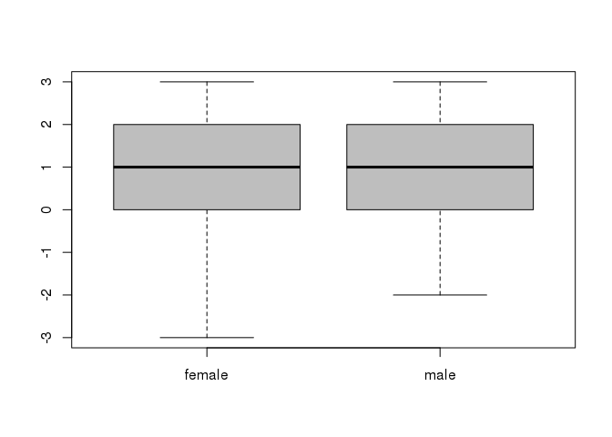
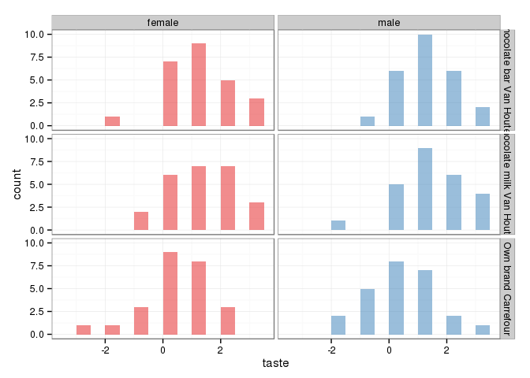
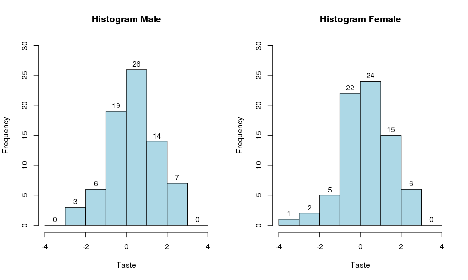
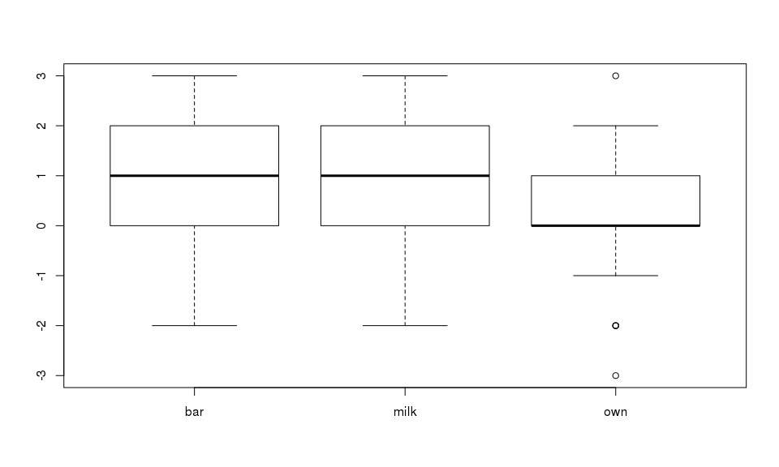
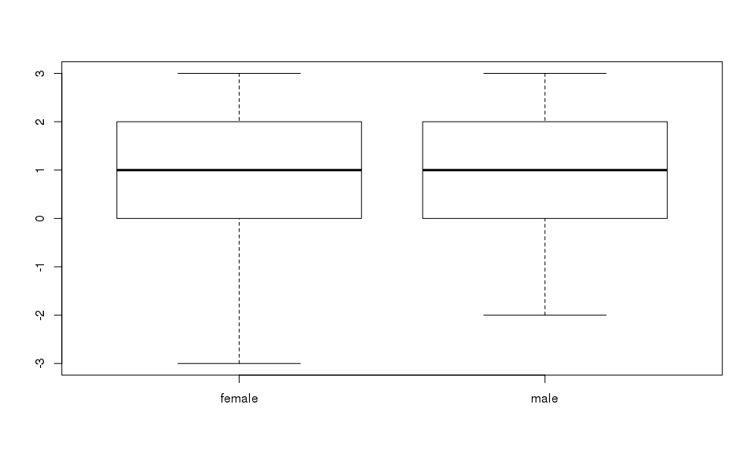
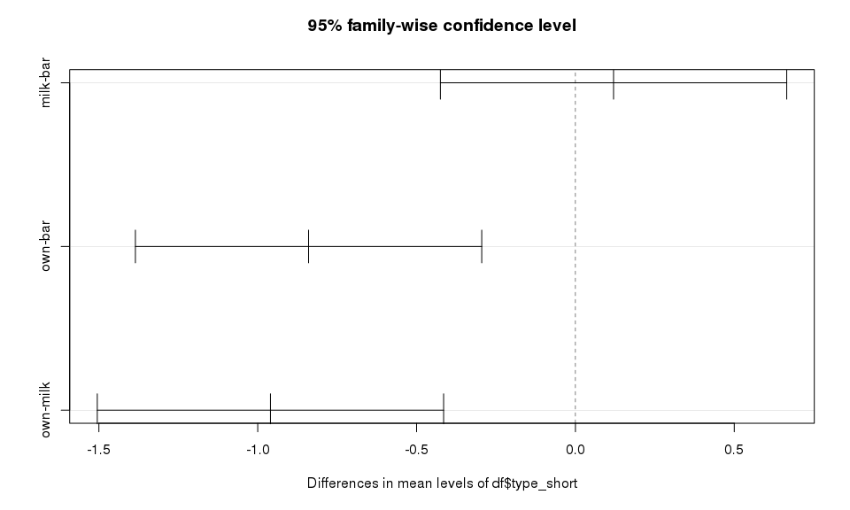
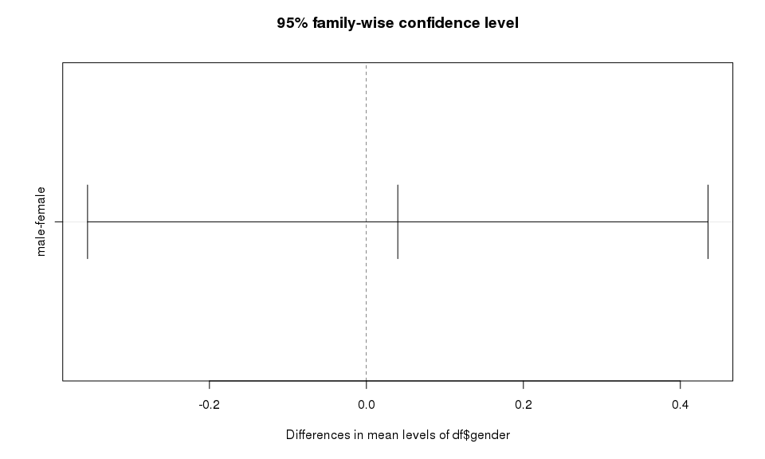
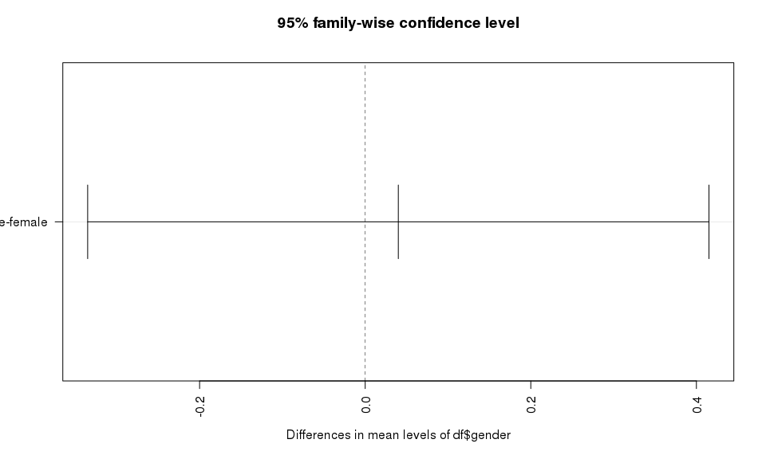
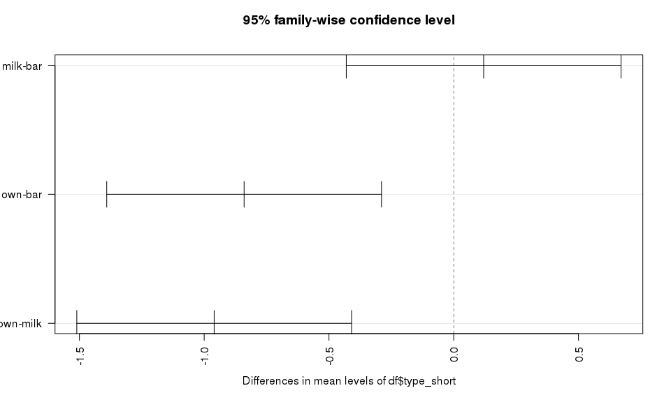
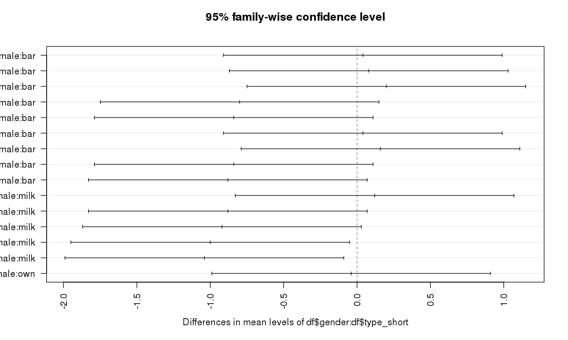

# Tasting Chocolate
John Letteboer  
11/23/2015  


Q1: Is there a difference taste score between female and male.

- H0: man = female
- H1: man $\ne$ female

Loading required packages.

```r
library(ggplot2)
library(RColorBrewer)
library(psych)
```

```
## 
## Attaching package: 'psych'
## 
## The following object is masked from 'package:ggplot2':
## 
##     %+%
```

```r
#library(MVN)
```

Load the dataset.

```r
df <- read.csv("Tasting_chocolate.csv", header=TRUE, sep = ";")
```

After loading the dataset let's have a look at the data.

```r
dim(df)
```

```
## [1] 150   4
```

```r
head(df)
```

```
##                  type gender gender.1 taste
## 1 Own brand Carrefour female        1    -2
## 2 Own brand Carrefour female        1    -3
## 3 Own brand Carrefour female        1     2
## 4 Own brand Carrefour female        1    -1
## 5 Own brand Carrefour female        1     2
## 6 Own brand Carrefour female        1     2
```

```r
str(df)
```

```
## 'data.frame':	150 obs. of  4 variables:
##  $ type    : Factor w/ 3 levels "Chocolate bar Van Houten",..: 3 3 3 3 3 3 3 3 3 3 ...
##  $ gender  : Factor w/ 2 levels "female","male": 1 1 1 1 1 1 1 1 1 1 ...
##  $ gender.1: int  1 1 1 1 1 1 1 1 1 1 ...
##  $ taste   : int  -2 -3 2 -1 2 2 -1 -1 1 1 ...
```

```r
summary(df)
```

```
##                         type       gender      gender.1       taste      
##  Chocolate bar Van Houten :50   female:75   Min.   :0.0   Min.   :-3.00  
##  Chocolate milk Van Houten:50   male  :75   1st Qu.:0.0   1st Qu.: 0.00  
##  Own brand Carrefour      :50               Median :0.5   Median : 1.00  
##                                             Mean   :0.5   Mean   : 0.82  
##                                             3rd Qu.:1.0   3rd Qu.: 2.00  
##                                             Max.   :1.0   Max.   : 3.00
```

```r
#describeBy(df, group = "gender")
```

We can see the dataset has 150 objects and 4 variables, `type`, `gender`, `gender.1` and `taste`.

### First Step
#### 1. Are there missing values?


```r
any(is.na(df))
```

```
## [1] FALSE
```

As we can see there are no missiong values.

#### 2. Are there outliers?

Let's make a boxplot to see if there are any outliers


```r
boxplot(df$taste ~ df$gender)
points(df$taste~df$gender,col="red")
```

 

There are no outliers.

#### 3. Are the data normal distrubuted

```r
library(RColorBrewer)
cols <- rev(brewer.pal(7,"Spectral"))
library(ggplot2)
ggplot(df, aes(taste, fill=gender)) + 
    facet_grid( type ~ gender) + 
    geom_histogram(binwidth=.5, alpha=.5, position="identity") + 
    theme_bw() + 
    scale_fill_manual(values = cols)
```

 

Let make two subsets of gender, `male` and `female`.

```r
male <- df[df$gender == "male",]
female <- df[df$gender == "female",]
```

Let see if the data is normal distributed.

```r
par(mfrow = c(1, 2))
hist(male$taste, 
     labels = TRUE, 
     breaks = c(-4:4), 
     main="Histogram Male", 
     xlab="Taste", 
     col="lightblue", 
     ylim = c(0,30))
hist(female$taste, 
     labels = TRUE, 
     breaks = c(-4:4), 
     main="Histogram Female", 
     xlab="Taste",
     col="lightblue", 
     ylim = c(0,30))
```

 

As we can see is the data normal distrubuted.

Let do a independent 2-group t-test

```r
t.test(taste ~ gender, df)
```

```
## 
## 	Welch Two Sample t-test
## 
## data:  taste by gender
## t = -0.19996, df = 147.99, p-value = 0.8418
## alternative hypothesis: true difference in means is not equal to 0
## 95 percent confidence interval:
##  -0.4352959  0.3552959
## sample estimates:
## mean in group female   mean in group male 
##                 0.80                 0.84
```


```r
df$type_short[df$type == "Own brand Carrefour"] <- "own"
df$type_short[df$type == "Chocolate bar Van Houten"] <- "bar"
df$type_short[df$type == "Chocolate milk Van Houten"] <- "milk"
df$type_short <- as.factor(df$type_short)

boxplot(df$taste ~ df$type_short)
```

 

```r
boxplot(df$taste ~ df$gender)
```

 

```r
aov1 <- aov(df$taste ~ df$type_short)
summary(aov1)
```

```
##                Df Sum Sq Mean Sq F value   Pr(>F)    
## df$type_short   2  27.36  13.680   10.32 6.37e-05 ***
## Residuals     147 194.78   1.325                     
## ---
## Signif. codes:  0 '***' 0.001 '**' 0.01 '*' 0.05 '.' 0.1 ' ' 1
```

```r
TukeyHSD(aov1)
```

```
##   Tukey multiple comparisons of means
##     95% family-wise confidence level
## 
## Fit: aov(formula = df$taste ~ df$type_short)
## 
## $`df$type_short`
##           diff        lwr        upr     p adj
## milk-bar  0.12 -0.4250909  0.6650909 0.8610935
## own-bar  -0.84 -1.3850909 -0.2949091 0.0010593
## own-milk -0.96 -1.5050909 -0.4149091 0.0001527
```

```r
plot(TukeyHSD(aov1))
```

 

```r
aov2 <- aov(df$taste ~ df$gender)
summary(aov2)
```

```
##              Df Sum Sq Mean Sq F value Pr(>F)
## df$gender     1   0.06    0.06    0.04  0.842
## Residuals   148 222.08    1.50
```

```r
TukeyHSD(aov2)
```

```
##   Tukey multiple comparisons of means
##     95% family-wise confidence level
## 
## Fit: aov(formula = df$taste ~ df$gender)
## 
## $`df$gender`
##             diff        lwr       upr     p adj
## male-female 0.04 -0.3552957 0.4352957 0.8417833
```

```r
plot(TukeyHSD(aov2))
```

 

```r
aov3 <- aov(df$taste ~ df$gender * df$type_short)
summary(aov3)
```

```
##                          Df Sum Sq Mean Sq F value   Pr(>F)    
## df$gender                 1   0.06   0.060   0.044    0.833    
## df$type_short             2  27.36  13.680  10.125 7.69e-05 ***
## df$gender:df$type_short   2   0.16   0.080   0.059    0.943    
## Residuals               144 194.56   1.351                     
## ---
## Signif. codes:  0 '***' 0.001 '**' 0.01 '*' 0.05 '.' 0.1 ' ' 1
```

```r
TukeyHSD(aov3)
```

```
##   Tukey multiple comparisons of means
##     95% family-wise confidence level
## 
## Fit: aov(formula = df$taste ~ df$gender * df$type_short)
## 
## $`df$gender`
##             diff        lwr       upr     p adj
## male-female 0.04 -0.3351831 0.4151831 0.8333945
## 
## $`df$type_short`
##           diff        lwr        upr     p adj
## milk-bar  0.12 -0.4305458  0.6705458 0.8635813
## own-bar  -0.84 -1.3905458 -0.2894542 0.0012067
## own-milk -0.96 -1.5105458 -0.4094542 0.0001805
## 
## $`df$gender:df$type_short`
##                         diff        lwr         upr     p adj
## male:bar-female:bar     0.04 -0.9096391  0.98963912 0.9999962
## female:milk-female:bar  0.08 -0.8696391  1.02963912 0.9998815
## male:milk-female:bar    0.20 -0.7496391  1.14963912 0.9902930
## female:own-female:bar  -0.80 -1.7496391  0.14963912 0.1518375
## male:own-female:bar    -0.84 -1.7896391  0.10963912 0.1154632
## female:milk-male:bar    0.04 -0.9096391  0.98963912 0.9999962
## male:milk-male:bar      0.16 -0.7896391  1.10963912 0.9965724
## female:own-male:bar    -0.84 -1.7896391  0.10963912 0.1154632
## male:own-male:bar      -0.88 -1.8296391  0.06963912 0.0863095
## male:milk-female:milk   0.12 -0.8296391  1.06963912 0.9991375
## female:own-female:milk -0.88 -1.8296391  0.06963912 0.0863095
## male:own-female:milk   -0.92 -1.8696391  0.02963912 0.0634551
## female:own-male:milk   -1.00 -1.9496391 -0.05036088 0.0327048
## male:own-male:milk     -1.04 -1.9896391 -0.09036088 0.0229513
## male:own-female:own    -0.04 -0.9896391  0.90963912 0.9999962
```

```r
plot(TukeyHSD(aov3), las = 2)
```

   
